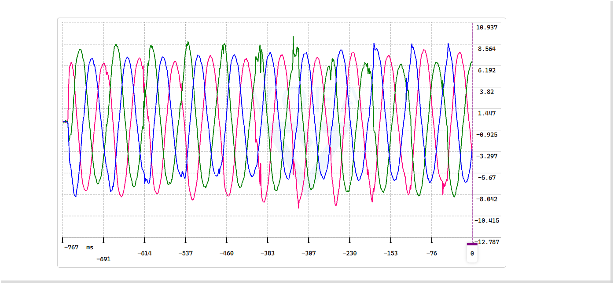
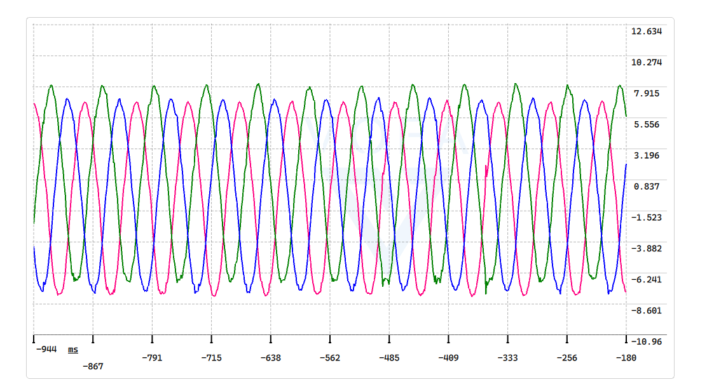
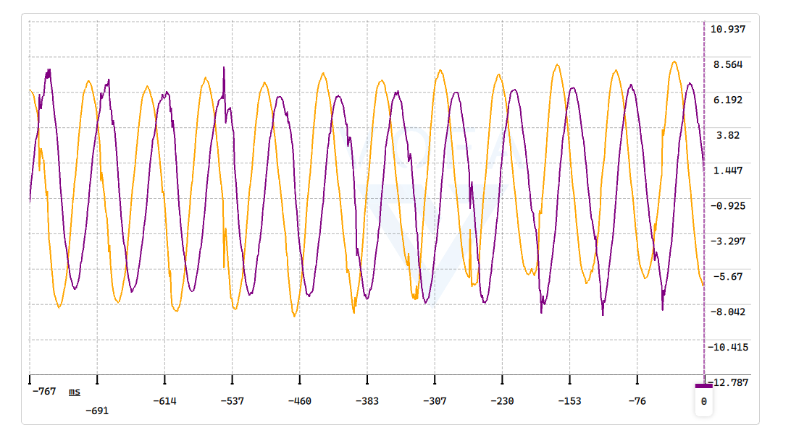
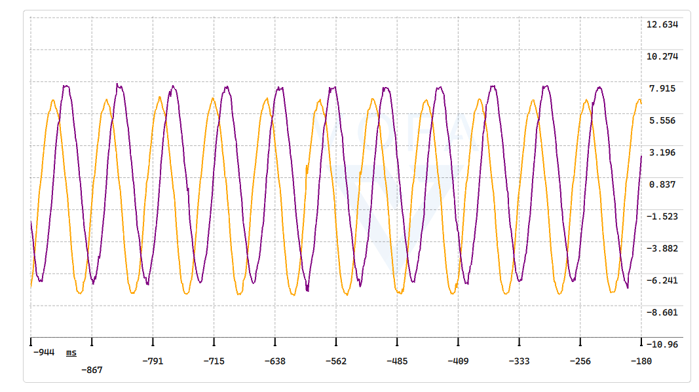

# FOC_STM32

基于 STM32 HAL 库的 PMSM 磁场定向控制（FOC）学习工程。项目从零搭建，按阶段推进：先做电压开环，再逐步实现电流采样、编码器角度、电流闭环和速度闭环。

## 硬件与软件环境

- MCU：STM32F407VET6
- 开发环境：STM32CubeMX + Keil MDK-ARM V5
- 电机驱动板：INMOP FOC 开发板
- 电机：带编码器的 PMSM（极对数 10，编码器 1024 PPR）
- 调试工具：ST-Link / 串口 / VOFA+

## 仓库结构

```text
foc_stm32/
├── Core/          CubeMX 生成的外设初始化和主程序
├── Drivers/       STM32F4 HAL 库和 CMSIS
├── App/           应用层（按键、VOFA+ 串口输出）
├── MotorFoc/      FOC 算法与控制（SVPWM、Clarke、开环控制）
├── Sdrive/        底层驱动（ADC 电流采样）
├── picture/       调试波形图片
├── MDK-ARM/       Keil 工程文件
├── STM32_FOC.ioc  CubeMX 工程配置
└── README.md
```

## 当前阶段总览

本 README 按阶段累积更新，不会用新阶段覆盖前面阶段的说明。

### 阶段 0：HAL 工程建立

- 使用 STM32CubeMX 生成 STM32F407VET6 基础工程。
- 配置时钟为 168MHz。
- 配置 LED、串口、ADC、TIM1、TIM3、TIM4 等外设。
- 通过点亮 LED 验证工程编译和烧录无误。

### 阶段 1：SVPWM 电压开环控制

当前已实现阶段 1，目标是验证 TIM1 三相 PWM 和 SVPWM 能正确驱动电机。

#### 实现了什么

- TIM1 输出三相互补 PWM，中心对齐模式。
- 实现七段式 SVPWM，将 αβ 轴电压矢量转换为三相比较值 CCR。
- 支持两种开环测试模式：
  - 锁轴测试：固定电压矢量，使转子吸附在某一电角度。
  - 开环旋转测试：电压矢量按固定电频率旋转，带动电机低速旋转。
- 加入按键控制：
  - KEY1：使能电机。
  - KEY2：失能电机。
  - KEY3：锁轴模式下切换 α 轴和 β 轴锁定方向。
- 启动 PWM 前先将三路 CCR 置于 50% 中点，确保从零电压矢量安全启动。

#### 实现原理

阶段 1 的信号链为：

```text
开环电角度 θ
→ Vα = U_amp · cosθ
→ Vβ = U_amp · sinθ
→ SVPWM_Update(Vα, Vβ)
→ CCR1/CCR2/CCR3
→ TIM1 三相互补 PWM
→ 三相桥 → 电机
```

其中：

- αβ 是定子静止坐标系，α 轴通常与 A 相绕组轴线重合，β 轴超前 α 轴 90°。
- `SVPWM_Update()` 先根据 αβ 电压计算三个中间量 `u1/u2/u3`，它们本质上是三路线电压除以 √3。
- 根据 `u1/u2/u3` 的正负判断电压矢量位于 6 个扇区中的哪一个。
- 确定扇区后，计算三相调制波 `Ta/Tb/Tc`。
- 以 `Vbase = Vdc/√3` 为基准电压，将电压量纲的 `Ta/Tb/Tc` 转换为标幺调制比 `m`。
- 最后通过 `CCR = m × TIM1_PERIOD_HALF + TIM1_PERIOD_HALF` 映射到定时器比较值。
- `CCR = 4200` 对应 50% 占空比，即零电压矢量。

#### 主要参数

| 参数 | 值 | 说明 |
|---|---|---|
| TIM1 周期 | 8400 | 中心对齐计数周期 |
| TIM1 中点 | 4200 | 50% 占空比，零矢量 |
| 死区 | 100 | TIM1 计数单位，约 595ns |
| 母线基准电压 | 12V | 标称值 |
| SVPWM 基准电压 | Vdc/√3 | 约 6.928V |
| 开环电压幅值 | 1.0V | 可在宏中调整 |
| 开环电频率 | 1Hz | 可在宏中调整 |

#### 代码分布

- `Core/Src/main.c`：只负责外设初始化和按键到控制模式的调度。
- `MotorFoc/foc.c/.h`：SVPWM 计算、TIM1 PWM 使能/关闭、开环锁轴与旋转控制。
- `App/key_app.c/.h`：KEY1/2/3 的初始化、消抖扫描和事件获取。

#### 如何测试阶段 1

锁轴测试：

1. 保持 `MotorFoc/foc.h` 中的 `FOC_STAGE1_LOCK_TEST` 为 1。
2. 编译烧录。
3. 按 KEY1，电机应被吸住并保持。
4. 按 KEY3，观察转子在 α 轴和 β 轴锁定位置之间切换。
5. 按 KEY2 停止。

开环旋转测试：

1. 将 `MotorFoc/foc.h` 中的 `FOC_STAGE1_LOCK_TEST` 改为 0。
2. 重新编译烧录。
3. 按 KEY1，电机开始低速旋转。
4. 按 KEY2 停止。

测试时请使用限流电源，并确认电机无负载或负载安全。

### 阶段 2：ADC 相电流采样与 Clarke 变换

阶段 2 在阶段 1 的基础上加入电流采样链，目标是得到真实三相电流和 αβ 轴电流。

#### 实现了什么

- ADC1 规则组采样 CH14、CH10、CH4，用于温度、母线电压和 VR。
- ADC1 注入组采样 CH15、CH9，分别对应 U 相和 W 相电流。
- 使用 TIM1_CH4 在 PWM 中心触发注入组采样，降低开关噪声。
- 电流零点在 PWM 输出零矢量期间标定，再按传感器增益换算为安培。
- 根据 `Iu + Iv + Iw = 0` 重建 V 相电流。
- 实现等幅值 Clarke 变换，得到 `Ialpha/Ibeta`。
- 通过 VOFA+ 非阻塞串口输出，观察三相电流和 αβ 电流波形。

#### 代码分布

- `Sdrive/current_sense.c/.h`：规则组 DMA、注入组启动、零点标定、电流滤波和换算。
- `MotorFoc/clarke.c/.h`：Clarke 变换。
- `App/vofa_app.c/.h`：VOFA+ JustFloat 非阻塞串口发送。
- `Core/Src/main.c`：初始化顺序和主循环调度。

#### PWM 中心同步 ADC 采样

当前使用 STM32F407 的 ADC 注入组实现 PWM 中心同步采样：

- TIM1_CH4 配置为 PWM Generation No Output，`Pulse = 4199`。
- ADC1 注入组触发源选择 `TIM1_CC4`，上升沿触发。
- U/W 相电流由注入组采样，Vbus 等慢速信号留在规则组连续采样。
- 上电后先以零电压矢量启动 PWM，完成电流零点标定，再关闭 PWM 等待 KEY1。

#### VOFA+ 串口输出

- 波特率：115200
- 协议：JustFloat
- 通道顺序：Iu、Iv、Iw、Ialpha、Ibeta、Vbus
- 每 5ms 尝试发送一帧，使用中断发送，不阻塞控制循环

#### 波形对比

普通 ADC 连续采样与 PWM 中心同步采样的对比如下。

三相电流波形：





αβ 轴电流波形：





可以看到，PWM 中心同步采样明显减少了开关瞬间的毛刺噪声。

#### 如何测试阶段 2

1. 保持阶段 1 的锁轴或开环旋转测试配置。
2. 编译烧录后，在调试器中观察 `g_current`：

```text
Iu
Iv
Iw
Ialpha
Ibeta
Vbus
```

3. 使用 VOFA+ 查看三相电流和 αβ 电流波形。
4. PWM 未使能时，三相电流应接近 0。
5. 按 KEY1 进入锁轴或旋转状态后，三相电流应为正弦波，αβ 轨迹应为圆形。

## 后续阶段计划

- 阶段 3：TIM3 编码器角度读取与电角度计算。
- 阶段 4：有感电流闭环 FOC。
- 阶段 5：速度闭环。

每个阶段提交时，都会在本 README 中追加对应阶段的实现说明，并保留前面阶段的说明。
